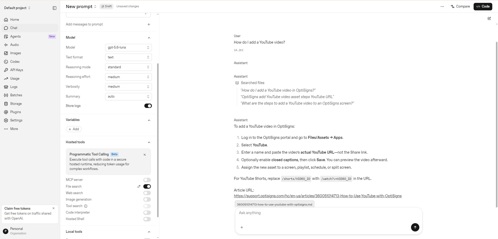

# part1-ingest

Scrapes a public help center into Markdown and keeps an OpenAI vector store in sync with it. A daily job uploads only what changed.

## Setup

```bash
cd part1-ingest            # from the repo root
python3 -m venv .venv && source .venv/bin/activate
pip install -r requirements.txt
cp .env.sample .env        # set OPENAI_API_KEY; the other settings are optional
```

Windows (PowerShell):

```powershell
cd part1-ingest
python -m venv .venv; .venv\Scripts\Activate.ps1
pip install -r requirements.txt
Copy-Item .env.sample .env
```

## Run

```bash
python -m app.scrape       # scrape only: writes out/<id>-<slug>.md
python main.py             # sync to the vector store; runs once, exits 0 when everything is in sync
pytest
```

Docker (only `OPENAI_API_KEY` is required):

```bash
docker build -t beacon-kb .
docker run --rm -e OPENAI_API_KEY=sk-... beacon-kb
```

## Chunking

Static chunks of 800 tokens with 200 tokens of overlap. The median article is about 800 tokens (409 articles, about 450k tokens in total), so a chunk is roughly one short article or one section. A 25% overlap keeps a step that falls on a boundary in both chunks. The API default overlap of 400 would give about 1,000 chunks instead of about 841 and mostly repeat text. The API does not report chunk counts, so the logged number is an estimate.

## What a run does

Each file is uploaded with its `article_id` and a hash of its text and chunk settings. A run compares those with the store: not there is **added**, hash changed is **updated** (the new file is uploaded before the old one is deleted), same hash is **skipped**, and an article gone from the help center is **removed**. Removal is off when `ARTICLE_LIMIT` is set. The exit code is 1 if any article failed.

```
[sync] added=30 updated=0 skipped=0 removed=0 failed=0 duration=25s
[embedded] files=30 est_chunks=~114 (max=800 overlap=200)
```

## Daily job on AWS

`deploy/aws.sh` deploys the job to AWS: an EventBridge schedule starts an ECS Fargate task every day at 02:00 (Asia/Ho_Chi_Minh), the image is kept in ECR, the OpenAI key in SSM Parameter Store, and the logs go to CloudWatch. It is written for AWS CloudShell, from the repository root:

```bash
bash part1-ingest/deploy/aws.sh up        # build and push the image, create the job and the schedule
bash part1-ingest/deploy/aws.sh run       # run it once and print the log
bash part1-ingest/deploy/aws.sh publish   # optional: publish the CloudShell view of the log by hand
bash part1-ingest/deploy/aws.sh down      # delete everything
```

By default the job syncs the first 30 articles (`ARTICLE_LIMIT`; set it to an empty value for all of them).

### Status page

At the end of every run the job itself overwrites three files in a public S3 bucket (`beacon-kb-logs-<8 characters>`, created by `up`, only `public/` is readable):

| File | Content |
|---|---|
| `public/index.html` | the latest result, a table of the last 30 runs, and the log of the latest run |
| `public/last_run.log` | the log of the latest run as plain text |
| `public/runs.json` | the history the table is built from |

The addresses never change, because the job always writes the same keys. `up` prints the page address: `https://beacon-kb-logs-<8 characters>.s3.ap-southeast-1.amazonaws.com/public/index.html`. It shows up after the first run.

The job needs `LOG_BUCKET` for this (`up` sets it; without it nothing is published). `LOG_PREFIX` (default `public`) and `REPO_URL` are optional. A problem while publishing is logged and never changes the exit code of the sync. The job refuses to publish a log that looks like it holds an API key, an ARN or an OpenAI id.

If the account has Block Public Access turned on for all buckets, `up` stops and says so: the page cannot be public until the bucket-policy settings are allowed.

`publish` is only for a manual snapshot: it copies the CloudShell view of the log (last 72 hours) to the same addresses. The logs of two runs on AWS are in [`docs/last_run.log`](docs/last_run.log).

## Sample answer

The assistant in the OpenAI Playground (model `gpt-5.6-luna`, File search on a small test vector store):



The answer has five steps and one `Article URL:` line that points to the source article.
